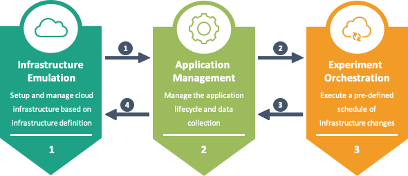

[](https://gitpod.io/#https://github.com/MoeweX/MockFog2)


# MockFog2

This project is part of [MockFog](https://moewex.github.io/publication/2019-mockfog/2019-mockfog.pdf) which includes the following subprojects:
* [MockFog2](https://github.com/OpenFogStack/MockFog2) New and more powerful version of MockFog (under active development)
* [MockFog-Meta (archived)](https://github.com/OpenFogStack/MockFog-Meta) Meta repository of the original MockFog prototype
* [MockFogLight (archived)](https://github.com/OpenFogStack/MockFogLight) A lightweight version of MockFog without a visual interface

Fog computing is an emerging computing paradigm that uses processing and storage capabilities located at the edge, in the cloud, and possibly in between. Testing or running experiments in the Fog, however, is hard since runtime infrastructures will typically be in use or may not exist, yet.

MockFog2 is a tool that can be used to emulate such infrastructures in the cloud. Developers can freely design emulated fog infrastructures and configure (or manipulate during runtime) performance characteristics. Furthermore, MockFog2 can manage to be evaluated applications and run pre-defined evaluation workloads.

If you use this software in a publication, please cite it as:

### Text
Jonathan Hasenburg, Martin Grambow, Elias Grünewald, Sascha Huk, David Bermbach. **MockFog: Emulating Fog Computing Infrastructure in the Cloud**. In: Proceedings of the First IEEE International Conference on Fog Computing 2019 (ICFC 2019). IEEE 2019.

### BibTeX
```
@inproceedings{hasenburg_mockfog:_2019,
	title = {{MockFog}: {Emulating} {Fog} {Computing} {Infrastructure} in the {Cloud}},
	booktitle = {Proceedings of the First {IEEE} {International} {Conference} on {Fog} {Computing} 2019 (ICFC 2019)},
	author = {Hasenburg, Jonathan and Grambow, Martin and Grunewald, Elias and Huk, Sascha and Bermbach, David},
	year = {2019},
	publisher = {IEEE}
}
```

A full list of our [publications](https://www.mcc.tu-berlin.de/menue/forschung/publikationen/parameter/en/) and [prototypes](https://www.mcc.tu-berlin.de/menue/forschung/prototypes/parameter/en/) is available on our group website.

## Project Overview

This project extends and builds upon prior versions of MockFog.
Depending on the current **stage** (1, 2, or 3), MockFog2 makes it possible to emulate a fog computing infrastructure, manage the lifecycle of a fog application, and orchestrate experiments with that application:



MockFog2 has two major components. At the moment (Version 3), they are capable of the following:

#### [Node Manager](node-manager/README.md)
The Node Manager is responsible for setting up the for the infrastructure emulation required virtual machines in the Cloud and installing the node agent.
It is also capable of managing the application lifecycle and the collection of experiment results.
Furthermore, in the third stage, it communicates with the node agents and optionally also the application for the sake of experiment orchestration.
The Node Manager is controlled through a node.js CLI application.

#### [Node Agent](node-agent/README.md)
The Node Agent is capable of manipulating the network properties of its machine at runtime and set resource limits on docker containers.
It offers a REST interface; this interface is fully documented with swagger and provides additional endpoints, e.g., to measure pings to other machine or retrieve the maximum resources of the machine it is running on.

## Quickstart using Gitpod
- Open the repository or an individual issue/PR in [Gitpod](https://gitpod.io/#https://github.com/MoeweX/MockFog2)
- Set the `AWS_ACCESS_KEY_ID` and `AWS_SECRET_ACCESS_KEY` environment variables in your [Gitpod settings](https://www.gitpod.io/docs/environment-variables/)
- Copy and customize  all .jsonc files from the `node-manager/run-example-crexplorer/config` directory to the `node-manager/run/config` directory (create the directory if it does not exist); when you skip this step all .jsonc files are copied without modification
- You can now use MockFog2, change directory to `node-manager` and bootstrap your infrastructure by running `node app.js bootstrap`

If you do not want to use Gitpod, run the tasks from the [.gitpod.yml](./.gitpod.yml) file manually before doing the above.

## Roadmap

For more information on the roadmap and related issues, see the [project overview](https://github.com/MoeweX/MockFog2/projects).

#### Version 1
Supports the management of the infrastructure (all functionality of stage 1). Code is properly documented and node agent offers basic functionalities. The node manager can be controlled via cli.

#### Version 2
Supports the management of the application (all functionality of stage 2). This includes application roll-out, startup, shutdown, and the collection of results.

#### Version 3 (current version)
Supports the orchestration of the infrastructure (all functionality of stage 3). For that, the node manager runs through pre-defined machine and network manipulations and distributes them to the affected node agents at the appropriate time.
The node manager is also capable of orchestrating application components that generate load.

#### Version 4
Supports advanced functionality to improve the user experience.

## Key Differences to MockFog(Light)
- Definition solely based on config files, no source code changes necessary to start an application
- All application components are deployed with docker
- Does not use ec2 inventory
- Uses node and npm to manage phases
- Network characteristics can be changed at runtime and on a per-container level
- No prerequisites for ami, just needs to be Amazon Linux 2 (e.g., ami-0a6dc7529cd559185 on eu-central-1)
