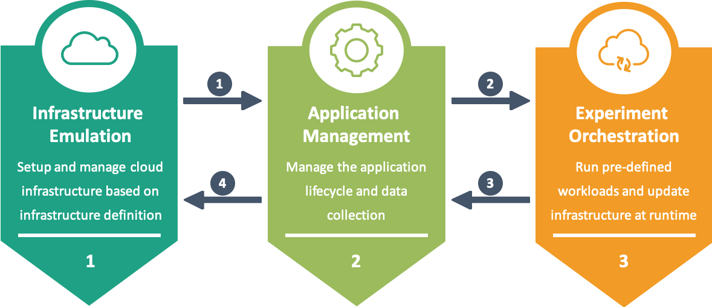

# MockFog2 Node Manager

The Node Manager is configured by four configuration files that should be placed in `run/config`:
- `infrastructure.jsonc`:  defines machines and how they are interconnected
- `container.jsonc`: defines docker containers + application specific configurations such as ENV variables
- `deployment.jsonc`: defines how containers are deployed on the infrastructure
- `orchestration.jsonc`: defines the orchestration schedule

You can find documentation on how to structure these configuration files and available capabilities in the two provided examples.
The [CRExplorer example](./run-example-crexplorer) will result in the deployment of the [CRExplorer](https://github.com/MoeweX/crexplorer) container on two machines out of three emulated servers. The orchestration schedule lets CRExplorer explore available resources and network characteristics.
The [Smart Factory example](./run-example-smartfactory) will result in the deployment of a [Smart Factory Application](https://github.com/MoeweX/smart-factory-fog-example) on multiple machines. The orchestration schedule comprises infrastructure and workload generation changes.

Before you begin using the node manager, you have to create/update configurations in `run/config` directory, json comments will be automatically removed with [strip-json-comments](https://www.npmjs.com/package/strip-json-comments).
A good starting point is to copy the configuration files from `run-example-crexplorer/config`.

## Stages and Phases

Depending on the current stage, MockFog2 makes it possible to emulate a fog computing infrastructure, manage the lifecycle of a fog application, and orchestrate experiments with that application:

Each stage comprises multiple phases that should, in general, be run consecutively.
At the moment, the easiest way of running a phase is through the command line.
However, as the node manager uses ansible playbooks under the hood, one can also run these [playbooks](./playbooks/) directly when necessary files are created manually.

### Stage 1 - Infrastructure Emulation

Start this phase by running `node app.js bootstrap`, this:
- Creates a var file for the bootstrap playbook at `run/vars/`
- Bootstraps the infrastructure on AWS based on `run/infrastructure.jsonc`
    - Setup a VPC
    - Setup a management subnet (access to internet, only ssh and node agent) -> mapped to eth0
    - Setup an internal subnet (access to all other machines, all traffic) -> mapped to eth1
    - Start EC2 instances that are part of this VPC
- Pulls ssh key and writes it to `run/<configured name>.pem`.
- Pulls machine facts and writes them to `run/machines/machine_meta.jsonc`
- Uses the configurations and machine facts data to prepare the ansible inventory that makes machines accessible by their machine_name and by container_name and writes it to `run/hosts`

Start this phase by running `node app.js agent`, this:
- Creates a var file for the agent playbook at `run/vars/`
- Installs pre-requisits on EC2 instances
- Copies the node agent to each remote and starts it

The node agent offers a REST-API that can be used to apply subsequent changes to network and machine characteristics.

Start this phase by running `node app.js manipulate`, this:
- Retrieves maximum resources per machine and existing connection delays between machines.
- Generates one tcconfig file per machine and stores them at `run/<machine_name>/tcconfig.json`; considers existing delays between machines.
- Uses HTTP Put request to supply the corresponding tcconfig to each agent

Start this phase by running `node app.js destroy`, this:
- Creates a var file for the destroy playbook, stores at `run/vars/`
- Destroys the VPC and all EC2 instances that have been part of the VPC
- Deletes all local files in the `run` directory that are not located in `./run/config`.

### Stage 2 - Application Management

Start this phase by running `node app.js prepare`, this:
- Creates a general var file for the prepare playbook at `run/vars/`
- Creates files and folders based on `run/container.jsonc` and `deployment.jsonc` for each container
    - Create local directories in `run/`
    - Create environment files in local directories
    - Create container specific var files for playbooks, stores at `run/vars/container/`
- On the remotes of each container:
    - Synchronize local directories
    - Pull application container images

Start this phase by running `node app.js start`, this:
- Creates a general var file for the start playbook, stores at `run/vars/`
- On the remotes of each container:
    - Starts the application container using the container specific var and environment files
    - Set defined resource limits

Start this phase by running `node app.js stop`, this:
- Creates a general var file for the stop playbook, stores at `run/vars/`
- Stops all docker containers on each remote

Start this phase by running `node app.js collect`, this:
- Creates a general var file for the collect playbook, stores at `run/vars/`
- Retrieves all container log files and application data and stores them in the corresponding local directory + machine name (e.g., `run/vars/appdata/camera-production-machine/`)

### Stage 3 - Experiment Orchestration

Start this phase by running `node app.js orchestrate`, this:
- Uses `run/orchestration.jsonc` to distribute machine manipulations, infrastructure manipulations, application instructions, and state notifications for each state.
- Transitions between stages based on time-based conditions and message-based conditions.

## Actions per Phase

Internally, each phase can comprise up to five standardized actions.
These actions are executed by the node manager and do not require user intervention.

## Direct Interactions

The node-manager directly interacts with/controls application containers in Stage 2 (Phase 02 - Start Containers and Phase 04 - Collect Results) and Stage 3.

In the following, we describe the prerequisites and the reason for each kind of interaction.

### Stage 2 Phase 2 - Start Containers

#### Environment Variables

Reason: Application Configuration, e.g., tell an application container about:
- ips and ports of other containers.
- the ip and port of the node manager.
- other configuration parameters.

Prerequisites: "env" object in container.jsonc contains environment variable information.

#### Application Input

Reason: Provide the application with additional required data, e.g., a log4j2.xml file.

Prerequisites: Files are placed in the "container_dirname" specified in container.jsonc.

#### Command Line Arguments

Reason: Provide application with required command line arguments.

Prerequisites: "command" list in container.jsonc contains the command line arguments.

### Stage 3 - Orchestration

#### State Notification

Reason: Notify application container about the successful transition to a particular state.

Prerequisites: "state_notifications" object in container.jsonc contains information on the HTTP endpoint.

#### Application Instructions

Reason: Change the behavior of the application at runtime, e.g., to update a workload generating component.

Prerequisites: "application_instructions" list in container.jsonc contains application instruction information.

#### State Acknowledgements

Reason: Acknowledge received state notification at node manager, e.g., to determine notification delay.

Prerequisites: Application received state notification and replies with HTTP 200.

#### Transition Condition Event

Reason: Needed for message-based transition conditions.

Prerequisites: Application sends events to node-manager /<apiVersion>/transition/messages endpoint.

### Stage 2 Phase 4 - Collect results

#### Log Files

Reason: Application logs can be analyzed.

Prerequisites: Application logs data to console.

#### Application Results

Reason: Application result files (i.e., files created by an application container) can be analyzed.

Prerequisites: Application writes files to the "container_dirname" specified in container.jsonc.
