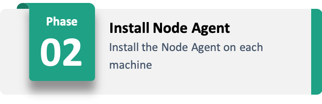
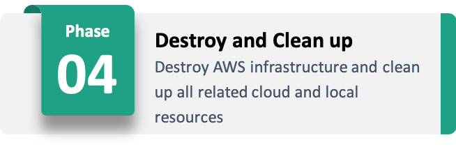

# Playbooks

This document lists required files that need to be available for the playbook of each phase.
For each of the files, a list to an example is needed. To understand how these files are created, please study the phases' [javascript code](../lib/stages/) directly.
Below, we also provide example commands with which, if all data is available in the required places, each playbook can be run with ansible directly.
Each of the example commands assumes to be executed in the `node-manager` directory; mentioned example files are also assumed to be placed, here.

It is possible to step through ansible tasks with `--step` and to start at a define task with `--start-at-task`, e.g., `--start-at-task="Create SSH Key"`.

### Stage 1 - Infrastructure Emulation


Requires:
- [./run/vars/0101_bootstrap.yml](../run-example/vars/0101_bootstrap.yml)

```bash
ansible-playbook --ssh-common-args="-o StrictHostKeyChecking=no" playbooks/0101_bootstrap.yml --extra-vars="@run/vars/0101_bootstrap.yml"
```



Requires:
- [./run/vars/0102_agent.yml](../run-example/vars/0102_agent.yml)
- `./run/ec2-mockfog2-ssh-key.pem` (key name depends on configuration)
- [./run/hosts](../run-example/hosts)

```bash
ansible-playbook --ssh-common-args="-o StrictHostKeyChecking=no" playbooks/0102_agent.yml -i "run/hosts" --key-file="run/ec2-mockfog2-ssh-key.pem" --extra-vars="@run/vars/0102_agent.yml"
```


There is no playbook for this phase.



Requires:
- [./run/vars/0104_destroy.yml](../run-example/vars/0104_destroy.yml)

```bash
ansible-playbook --ssh-common-args="-o StrictHostKeyChecking=no" playbooks/0104_destroy.yml --extra-vars="@run/vars/0104_destroy.yml"
```

### Stage 2 - Application Management


Requires:
- [./run/vars/0201_prepare.yml](../run-example/vars/0201_prepare.yml)
- `./run/ec2-mockfog2-ssh-key.pem` (key name depends on configuration)
- [./run/hosts](../run-example/hosts)
- container specific vars, e.g., [./run/vars/container/camera.yml](../run-example/vars/container/camera.yml)
- container specific environment file, e.g., [./run/appdata/camera/env_file.env](./run-example/appdata/camera/env_file.env) (storage location depends on configuration)

```bash
# Command targets the preparation of the camera container (can be controlled through --limit option)
ansible-playbook --ssh-common-args="-o StrictHostKeyChecking=no" playbooks/0201_prepare.yml -i "run/hosts" --key-file="run/ec2-mockfog2-ssh-key.pem" --extra-vars="@run/vars/0201_prepare.yml" --extra-vars="@run/vars/container/camera.yml" --limit="camera"
```


Requires:
- [./run/vars/0202_start.yml](../run-example/vars/0202_start.yml)
- `./run/ec2-mockfog2-ssh-key.pem` (key name depends on configuration)
- [./run/hosts](../run-example/hosts)
- container specific vars, e.g., [./run/vars/container/camera.yml](../run-example/vars/container/camera.yml)

```bash
# Command targets the start of the camera container (can be controlled through --limit option)
ansible-playbook --ssh-common-args="-o StrictHostKeyChecking=no" playbooks/0202_start.yml -i "run/hosts" --key-file="run/ec2-mockfog2-ssh-key.pem" --extra-vars="@run/vars/0202_start.yml" --extra-vars="@run/vars/container/camera.yml" --limit="camera"
```


Requires:
- [./run/vars/0203_stop.yml](../run-example/vars/0203_stop.yml)
- `./run/ec2-mockfog2-ssh-key.pem` (key name depends on configuration)
- [./run/hosts](../run-example/config/hosts)

```bash
ansible-playbook --ssh-common-args="-o StrictHostKeyChecking=no" playbooks/0203_stop.yml -i "run/hosts" --key-file="run/ec2-mockfog2-ssh-key.pem" --extra-vars="@run/vars/0203_stop.yml"
```


Requires:
- [./run/vars/0204_collect.yml](../run-example/vars/0204_collect.yml)
- `./run/ec2-mockfog2-ssh-key.pem` (key name depends on configuration)
- [./run/hosts](../run-example/hosts)
- container specific vars, e.g., [./run/vars/container/camera.yml](../run-example/vars/container/camera.yml)
- folder to store results, e.g., `./run/appdata/camera/` (storage location depends on configuration)

```bash
# Command targets the collection of results from the camera container (can be controlled through --limit option)
ansible-playbook --ssh-common-args="-o StrictHostKeyChecking=no" playbooks/0204_collect.yml -i "run/hosts" --key-file="run/ec2-mockfog2-ssh-key.pem" --extra-vars="@run/vars/0204_collect.yml" --extra-vars="@run/vars/container/camera.yml" --limit="camera"
```

### Stage 3 - Experiment Orchestration

Stage three does not have any playbooks.
